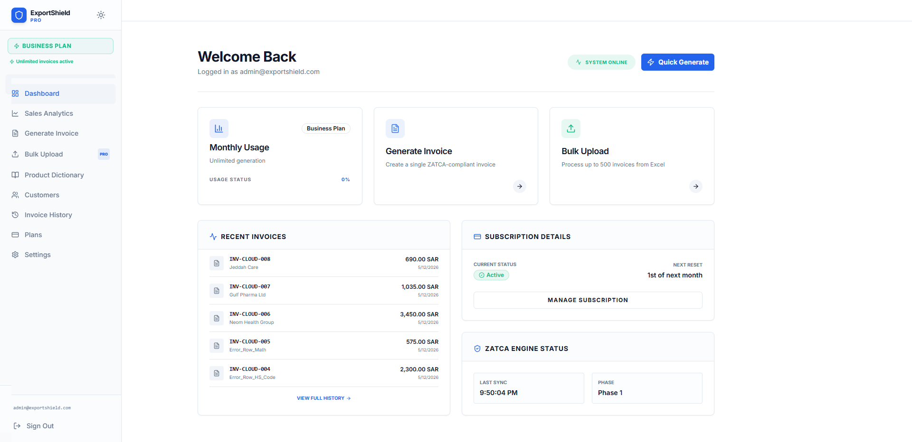
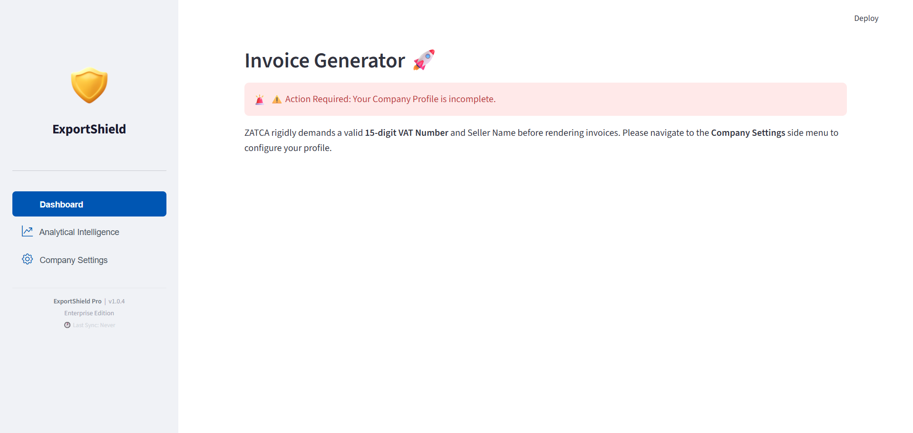
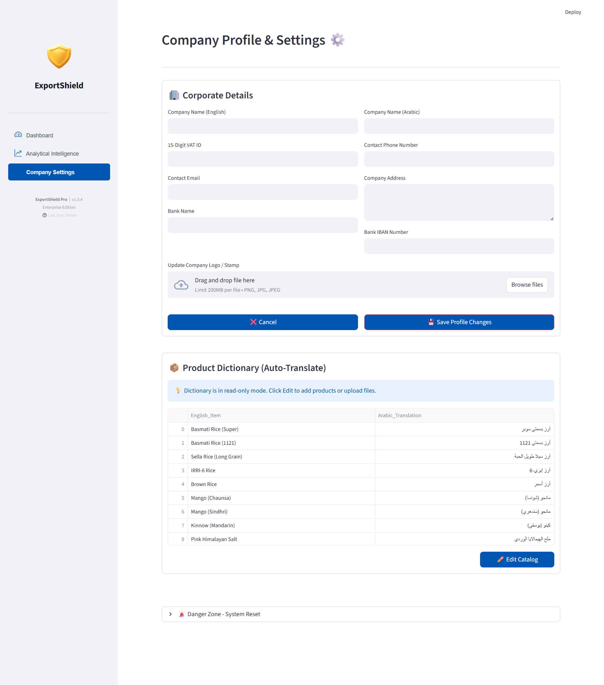

# 🛡️ ExportShield Pro — Complete ZATCA Compliance Suite (Cloud SaaS & Offline Node)

> **ExportShield Pro** is an enterprise-grade e-Invoicing suite designed specifically for exporters in Saudi Arabia and Pakistan. It bridges the gap between messy trade operations and rigid Middle Eastern customs regulations by offering two distinct architectures: a highly scalable **Cloud SaaS Platform** and a secure, air-gapped **Offline Desktop Application**.

> **⚠️ NOTE:** This repository is a **Technical Showcase** for portfolio purposes. Source code is maintained in a private repository as this is a shipped commercial product.

---

## ☁️ Cloud SaaS Platform Architecture

Built on a modern stack using a **FastAPI (Python 3.11)** backend and an interactive **Next.js 14** (App Router + Tailwind CSS + shadcn/ui) frontend. Data and authentication are powered by **Supabase Cloud**.

### 1. 📂 Core Product Features (User Journey)

#### A. Step-by-Step Intelligent Bulk Upload Wizard (SmartMap)
- **Problem:** Exporters have varying sales sheets (e.g., column names like 'invoice_no' vs. 'bill#').
- **Solution:** Our proprietary Intelligent SmartMap Algorithm. Users upload generic Excel/CSV files. The system uses AI-heuristics to auto-detect and map columns (Invoice Number, Date, Price, Quantity, VAT rate), implementing custom safeguards to prevent Tax IDs from being mismatched with tax percentages.

#### B. Interactive Live-Audit Data Grid
- **Real-time Corrections:** Red-alert error badges instantly block rows with invalid data (e.g., negative quantities, incorrect date formats, missing buyer names).
- **Reactive Background Sync:** Users can double-click any cell to make corrections. Pressing Enter triggers a dynamic `/audit` API call to update status badges and platform health scores (e.g., 88% to 100%) in real-time.
- **Auto-Fix Heuristics:** Standardizes date patterns, fills missing seller VATs, and corrects invalid VAT rates with a single click.
- **AI Fix (Gemini Integration):** Deep errors are corrected via Google's Gemini-Flash-1.5 model (integrated via OpenRouter) with just one click.

#### C. Compliant Invoicing Engine
- **ZATCA Compliant XML:** Auto-generates UBL 2.1 standard XML components.
- **Bilingual Arabic/English PDF:** Generates professional dynamic layouts with right-to-left (RTL) Arabic support, company branding, and bank details.
- **ZATCA QR Code TLV Encoder:** Converts 5 mandatory tags into the required binary Tag-Length-Value (TLV) format and renders a valid cryptographic QR image.
- **NTN / VAT Flexibility:** Seamlessly handles 15-digit Saudi VAT formats as well as 7-15 character alphanumeric Pakistani NTNs.

### 2. 🔒 Enterprise-Grade Security & Controls
- **Dual-Layer Encryption:** Client-side AES encryption secures pricing information before it hits the database.
- **Tenant Isolation:** Complete data separation using Supabase Row Level Security (RLS) policies.
- **Rate Limiting:** JWT-based tracking limits requests to 60/minute per tenant.
- **Usage Soft-Reset:** Database triggers (`pg_cron`) paired with backend safety syncs ensure accurate monthly subscription limits.
- **Multi-Bucket Layout:** Isolated Supabase storage buckets for invoice assets, logos, and payment proofs.

### 3. 👑 Platform Control Center
A dedicated Dark-Themed Admin Portal `/control-center` allows direct user credential management via Supabase Admin API and a Subscription Desk to review manual bank transfer proofs and approve plans.

### 🚀 Pitch to Future (Phase 2 Roadmap)
- **ZATCA Phase 2 ECDSA Integration:** Cryptographic signatures and secure certificates.
- **Automated Payments Gateway:** Stripe, JazzCash, and Easypaisa integration.
- **Notification Engine:** Automated email workflows via Resend/SendGrid.

---

## 🖥️ Offline Windows Desktop Application (Gold Master)

A high-performance, air-gapped compliance suite packaged as a single executable for completely offline operation.

### 💎 Core ExportShield Offline Features

1. **Node-Locked License Security:** 
   Prevents software piracy by generating a hardware fingerprint using the motherboard's Windows UUID (hashed with a secure salt). Software is locked to specific corporate machines.
2. **Compliant ZATCA Base64 TLV QR Code Generator:** 
   Packs Seller Name, Saudi VAT ID, Timestamp, Total Amount, and VAT Amount into a binary TLV byte-stream. Scans "Green" (Verified) on the official ZATCA app.
3. **SQLite-Powered Product Dictionary with Auto-Translate:** 
   Maintains an active embedded database mapping English trade items to Arabic. Automatically translates unmatched terms via Google Translate API and caches them offline.
4. **Smart Validation Grid with Inline Editing:** 
   Runs real-time diagnostic checks on all rows. Users fix errors directly inside the browser-like table without returning to Excel.
5. **Analytical Intelligence Dashboard:** 
   Visualizes history logs, aggregate KPIs, daily volume trends, and hour-of-day heatmaps from local batch executions.

---

## 📸 Screenshots

### Cloud SaaS Platform
#### 🚀 Landing Page

#### 📊 Cloud Dashboard

#### 📂 Intelligent Batch Processing

#### ⚡ Generate Invoice Interface

### Offline Application
#### 🖥️ Dashboard

#### 📊 Analytical Intelligence

#### 🏢 Company Settings

---

## 👨‍💻 Architected By

**Muhammad Ahsaan Ullah**  
AI Automation & Full-Stack Engineer

<b>ExportShield Pro — Making ZATCA compliance accessible and secure.</b>

